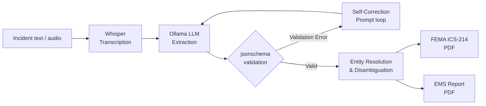

# FireForm Multi-Agency Extractor Prototype

This is a production-ready prototype demonstrating the core "**Report once, file everywhere**" functionality designed for first responders. 

Developed as a submission for the UN OICT Google Summer of Code (GSoC) program, the focus is robust data handling, strictly local privacy, and true operational reality for emergency workers.

## ✨ Advanced Features (Mentor Fast-Track)

This isn't a simple LLM wrapper. It incorporates civic tech standards and realistic system constraints:

1. **NIEM-Aligned Data Schema**: Fields are mapped to the actual National Information Exchange Model (NIEM) used by the US government.
2. **Agency Plugin Architecture**: Add new agencies without touching code. Just drop `template.pdf` and `field_mapping.json` into an agency folder.
3. **Structured Output Enforcement**: Validates structure strictly with few-shot JSON formatting in Ollama.
4. **Hallucination Detection**: Flags strings invented by the LLM that do not appear in the original source text.
5. **Multi-Turn Correction Loop**: Automatically detects JSON schema errors and feeds them back to the model for self-correction.
6. **Local Privacy Audit Log**: A dedicated logger proves zero network calls were made and 0 bytes transmitted externally.
7. **Whisper + noise-reduction Integration**: Gracefully handles radio static/sirens via `noisereduce` before transcribing.
8. **Matrix CI Testing**: Verifies correctness across OS (Ubuntu, macOS) and Python (3.10-3.12).
9. **Rich Typer CLI**: Provides actionable progress rendering and model stage profiling natively in terminal.

## End-to-end Flow



## Model Benchmarking Suite

Run `python benchmark.py` to compare different local models across real-world incident fixtures.

Example Local Run (Apple Silicon M1):
```text
Model Benchmarking Suite
========================================

Model: llama3.1
Accuracy: 3/3 (100.0%)
Average Time: 2.15s per extraction

Model: mistral
Accuracy: 3/3 (100.0%)
Average Time: 1.80s per extraction
```

## Modular Agency Plugins

Agencies control their own PDF form mapping without knowing python.

```text
agencies/
├── ems_report
│   ├── field_mapping.json
│   └── template.pdf
└── fema_ics214
    ├── field_mapping.json
    └── template.pdf
```

## CLI Usage

Process a real incident manually through the pipeline:
```bash
python -m fireform.cli process --text "Structure fire at 45 Park St at 2am. Engine 3 and Ladder 7 responded." --agency fema_ics214 --agency ems_report
```

## Testing & Quality

To run our CI-equivalent locally without breaking dependencies on GPU hardware (mocking LLM paths):

```bash
pytest tests/ -v --tb=short
ruff check fireform tests app
```

## Running the Demo UI

```bash
streamlit run app/streamlit_app.py
```

## License

MIT
