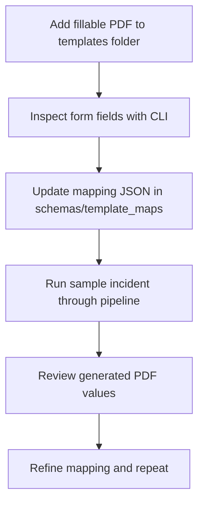

# Templates Guide

This folder is for real agency forms used by the prototype.

The default setup expects two fillable PDFs:

- fire_report_template.pdf
- ems_report_template.pdf

If you choose different names, update your run settings or mapping references.

## Template onboarding flow



## Recommended setup steps

1. Copy a fillable PDF into this templates folder.
2. List the field names using:

   ```bash
   fireform --inspect-template templates/fire_report_template.pdf
   ```

3. Open the matching mapping file in schemas/template_maps.
4. Map canonical incident keys to exact PDF field names.
5. Run the pipeline with a known sample incident.
6. Review the output PDF and adjust mappings until it looks correct.

## Mapping files

- schemas/template_maps/fire_department.json
- schemas/template_maps/ems_department.json

## Practical notes

- Public-domain forms are recommended for demo sharing, including FEMA ICS variants.
- AcroForm-style fillable fields are the most reliable.
- CI uses mocked PDF behavior, so tests still pass without real template files.
